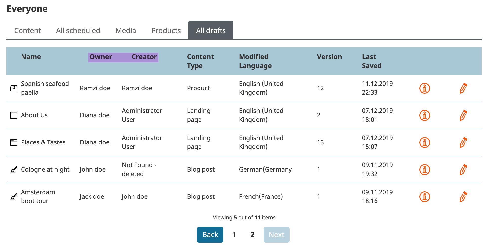
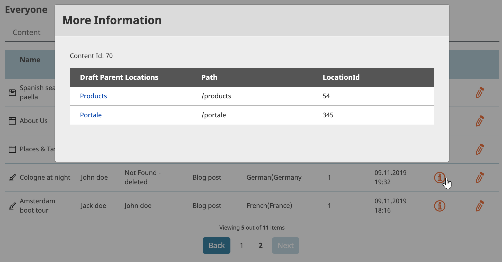

# Drafts Tools Bundle

This bundle allows you to have access to all drafts by adding a new API layer. eZPlatform is designed to get only access to drafts for current logged in user over the public API. The Rest API operating on top is requiring additional user token to have access though. 

## Requirement

eZPlatform 2.x +

## Features

- Habe access to private drafts in the everyone dashboard block
- Add additional column in me/all draft tabs to have an information about future draft location(s)
- Add permission for all drafts tab `dashboard/alldrafts`(ToDo)
- Preview draft link for external user(ToDo)
- Rest API endpoint(ToDo)
 
## Installation

```
composer require arfaram/draftstoolsbundle:dev-master
```

- Activate the Bundle in AppKernel.php

```
    public function registerBundles()
    {
        $bundles = array(
            //...
            new EzPlatform\DraftsToolsBundle\EzSystemsDraftsToolsBundle(),

```

## Screenshots







